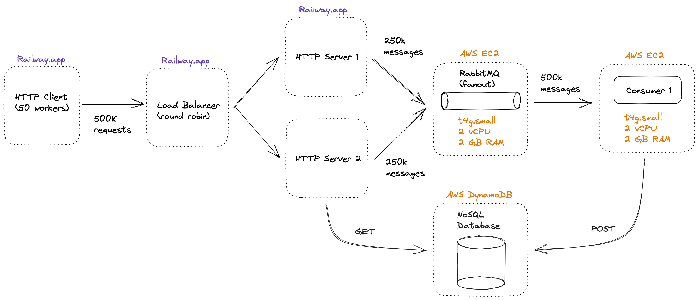
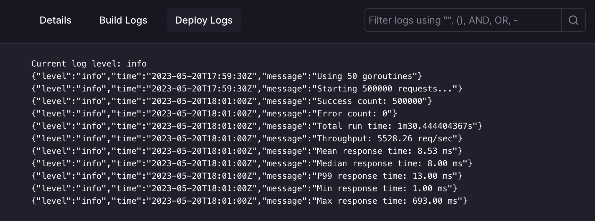
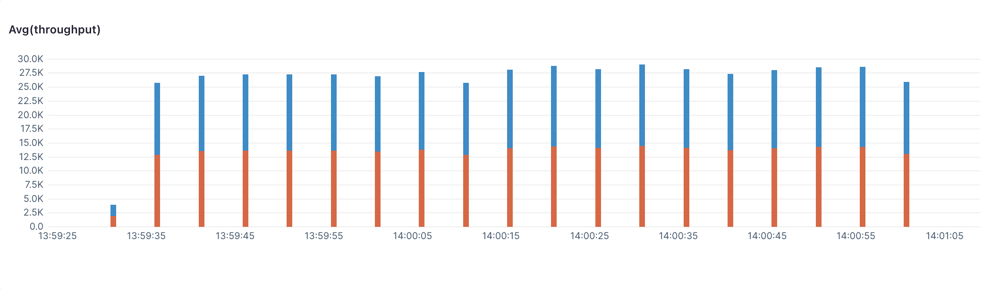
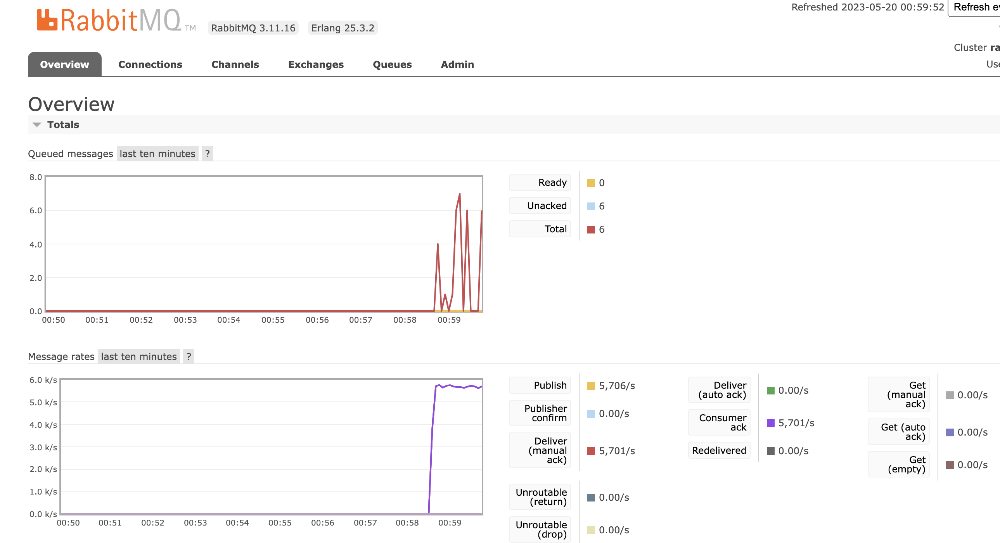
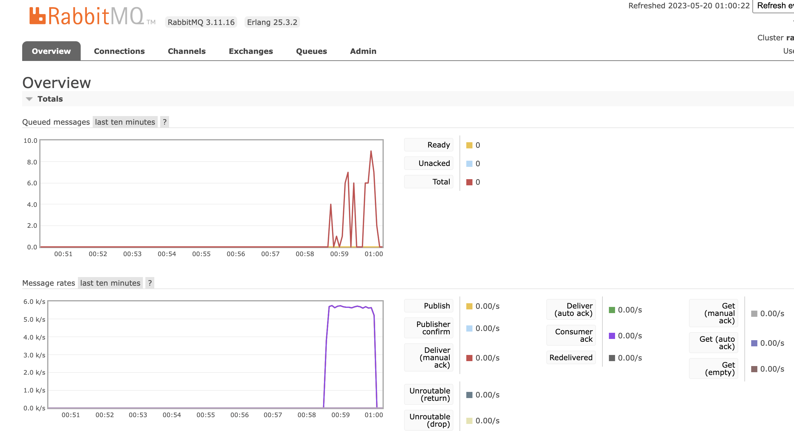
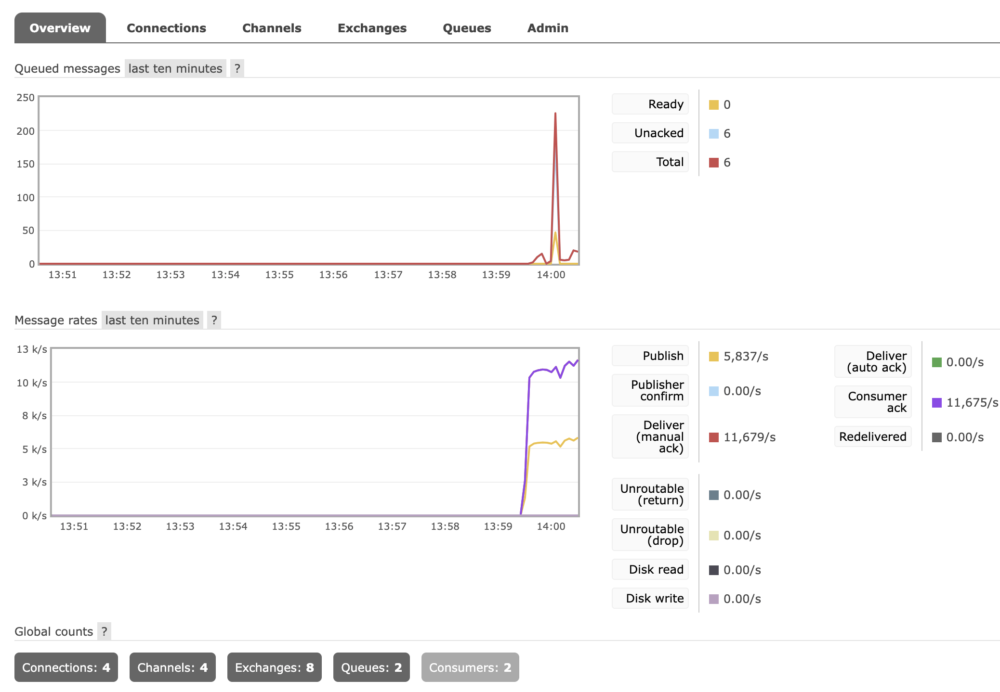
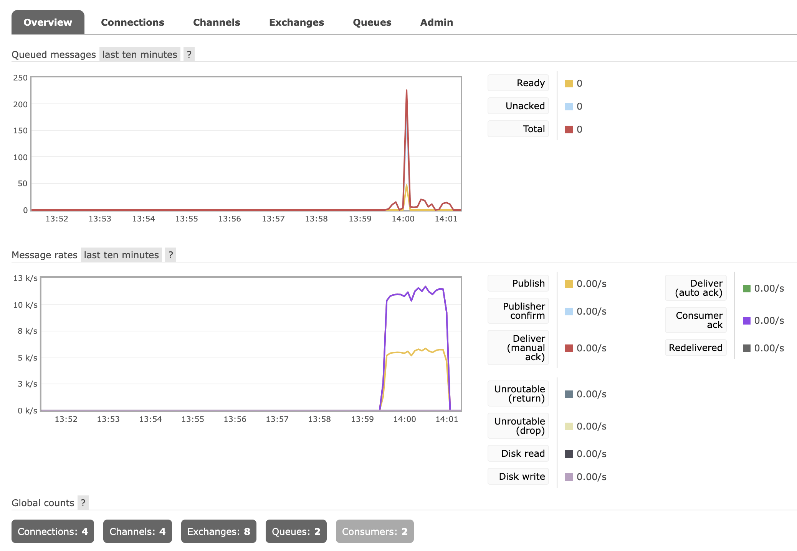

# Twinder Assignment 3

## Key Takeaways

- DynamoDB scales very well but RIP your credit card.
- Don't use DynamoDB... just keep it simple with PostgreSQL or SQLite.

## Design



The client makes 500k POST requests to `/swipe/{leftorright}/` as fast as possible. It also makes 5 GET requests every 1 second to the endpoints `/stats/{userId}/` and `/matches/{userId}` in a round robin fashion.

**Railway region:** us-west-2  
**AWS region:** us-east-2

**Each Consumer has the following configuration:**

Number of goroutines = 4  
QoS Prefetch = 128

## Results

### Client metrics onto 2 HTTP Server instances



The performance is very similar to Assignment 1 even though the HTTP server is horizontally scaled which indicates that the bottleneck is somewhere else. Nevertheless, 5500 req/sec is quite sufficient.

### 2 HTTP Server metrics



Since there are 2 HTTP Servers, the throughput data needs to be added up. "Orange" is server 1 and "Blue" is server 2. The metrics are gathered every 5 seconds. The total throughput is roughly 5500 req/sec during peak load.

### RabbitMQ metrics with 2 HTTP Servers and 1 Consumer





The publisher and consumer rates are nearly equal which is a great sign. There are very few messages stored in the queue at any given moment. The performance is excellent since it matches the client's load production rate of roughly 5500 req/sec.

### RabbitMQ metrics with 2 HTTP servers and 2 Consumers





The consume rate is 2x the publish rate because there are now 2 consumers and the exchange method is "fanout". There is one spike of 225 queued messages, but it is quickly handled by the consumers. Overall, the performance is excellent since it matches the client's load production rate of roughly 5500 req/sec.

### Consumer Data Storage

Data is stored in a simple in-memory hashmap for now. The data can be accessed on two endpoints:

#### GET /swipes?userId={int}

Example

```
http://123.456.78.90:8080/swipes?userId=1234

{
    "usedId":"1234",
    "likes":112,
    "dislikes":106
}
```

#### GET /matches?userId={int}

Example

```
http://123.456.78.90:8080/matches?userId=1234

{
  "usedId": "1234",
  "matches": [
    "265830",
    "953906",
    "336480",
    ...
    "565259"
  ]
}
```

Since we don't have a database viewer like Firebase or Prisma, you can retrieve all data in the hashmap on the endpoint:

```
GET /swipes/all
```
